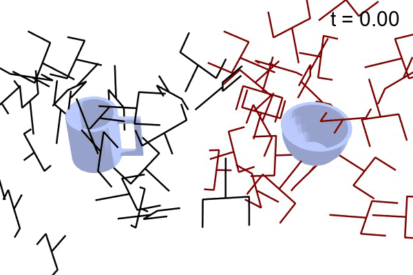

# EquiGraspFlow: SE(3)-Equivariant 6-DoF Grasp Pose Generative Flows

The official repository for <b><EquiGraspFlow: SE(3)-Equivariant 6-DoF Grasp Pose Generative Flows></b> (Byeongdo Lim, Jongmin Kim, Jihwan Kim, Yonghyeon Lee, and Frank C. Park, CoRL 2024)

- [Project page](https://equigraspflow.github.io/)
- [Openreview](https://openreview.net/forum?id=5lSkn5v4LK&referrer=%5BAuthor%20Console%5D(%2Fgroup%3Fid%3Drobot-learning.org%2FCoRL%2F2024%2FConference%2FAuthors%23your-submissions))
- [Paper](https://openreview.net/pdf?id=5lSkn5v4LK)
- [Video](https://youtu.be/fxOveMwugo4?si=L1bmYNOMPbCHY1Cr)
- [Poster](https://drive.google.com/file/d/1UTBoNDDT7FzHcXHSrFDA6x4v5hr3-g51/view?usp=sharing)

<br>




## Requirements

### Conda environment

You can create a Conda environment using the following command.
You can customize the environment name by modifying the `name` field in the `environment.yml` file.

```bash
conda env create -f environment.yml
```

This will automatically install the required packages, including:

- `python==3.10`
- `omegaconf`
- `tensorboardX`
- `pyyaml`
- `numpy==1.26`
- `torch`
- `scipy`
- `tqdm`
- `h5py`
- `open3d==0.16.0`
- `roma`
- `pandas`
- `openypyxl`

To activate the environment, use:

```bash
conda activate equigraspflow
```


### Dataset

We use the Laptop, Mug, Bowl, and Pencil categories of the ACRONYM dataset [1].
The dataset can be downloaded from [this link](https://drive.google.com/drive/folders/1H1PeUbyxvNtzoWc6Le2pKqOqp2WLSnau?usp=drive_link).
Create a `dataset` directory and place the data in that directory, or customize the path to the dataset by modifying `DATASET_DIR` in `acronym.py` and `utils.py` within the `loaders` directory.


## Training

### Train a new model

The training script is `train.py`, and comes with the following arguments:

- `--config`: Path to the training configuration YAML file.
- `--device`: GPU number to use (default: `0`). Use `cpu` to run on CPU.
- `--logdir`: Directory where the results will be saved (default: `train_results`).
- `--run`: Name for the training session (default: `{date}-{time}`).

To train EquiGraspFlow using the full point cloud, run:

```bash
python train.py --config configs/equigraspflow_full.yml
```

Alternatively, to train EquiGraspFlow with the partial point cloud, use:

```bash
python train.py --config configs/equigraspflow_partial.yml
```

<b>Note</b>: Training with the partial point cloud cannot be done in headless mode; a display is required.

You can change the data augmentation strategy for each data split by modifying the `augmentation` field in the training configuration YAML file.


### View training results

We log the results of the training process using TensorBoard. You can view the TensorBoard results by running:

```bash
tensorboard --logdir {path} --host {IP_address}
```
Replace `path` with the specific path to your training results and `IP_address` with your IP address.


## Pretrained models

The pretrained models can be downloaded from [this link](https://drive.google.com/drive/folders/1H-MXRVcTekdEfzXU_suSw7Afi-7o8I39?usp=sharing).


## Test

### Run test

The test scripts, `test_full.py` and `test_partial.py`, calculate the Earth Mover's Distance [2] between the generated and ground-truth grasp poses and store the visualizations of the generated grasp poses.
It has the following arguments:

- `--train_result_path`: Path to the directory containing training results.
- `--checkpoint`: Model checkpoint to use.
- `--device`: GPU number to use (default: `0`). Use `cpu` to run on CPU.
- `--logdir`: Directory where the results will be saved (default: `test_results`).
- `--run`: Name for the experiment (default: `{date}-{time}`).

For example, to test EquiGraspFlow using the full point cloud with the `model_best_val_loss.pkl` checkpoint in `pretrained_model/equigraspflow_full` directory, use:

```bash
python test_full.py --train_result_path train_results/equigraspflow_full --checkpoint model_best_val_loss.pkl
```

Alternatively, to test EquiGraspFlow using the partial point cloud with the `model_best_val_loss.pkl` checkpoint in `pretrained_model/equigraspflow_partial` directory, use:

```bash
python test_partial.py --train_result_path train_results/equigraspflow_partial --checkpoint model_best_val_loss.pkl
```


### Display visualizations

The visualizations of the generated grasp poses are stored in `visualizations.json` within the test results directory.
To display these visualizations, use the following code:

```python
import plotly.io as pio

pio.from_json(open('{path}/visualizations.json', 'r').read()).show()
```

Replace `path` with your test results directory.


## References

[1] C. Eppner, A. Mousavian, and D. Fox. Acronym: A large-scale grasp dataset based on simulation, ICRA 2021. [[paper](https://ieeexplore.ieee.org/stamp/stamp.jsp?arnumber=9560844&casa_token=VAlWdJNx458AAAAA:z3KlV9ALMjYG34RNbCVmUPEPlFkS6b7NIty76glWYuMbn3XwXpTtmrTV2PnmzhrGr_5QN_jQpg&tag=1)]

[2] A. Tanaka. Discriminator optimal transport. NeurIPS 2019. [[paper](https://proceedings.neurips.cc/paper/2019/file/8abfe8ac9ec214d68541fcb888c0b4c3-Paper.pdf)]


## Citation
If you found this repository useful in your research, please cite:

```text
@inproceedings{lim2024equigraspflow,
  title={EquiGraspFlow: SE (3)-Equivariant 6-DoF Grasp Pose Generative Flows},
  author={Lim, Byeongdo and Kim, Jongmin and Kim, Jihwan and Lee, Yonghyeon and Park, Frank C},
  booktitle={8th Annual Conference on Robot Learning},
  year={2024}
}
```
